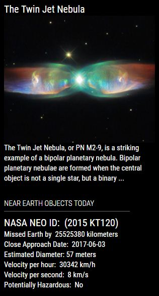
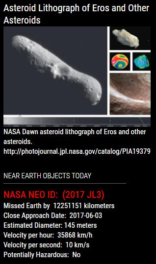
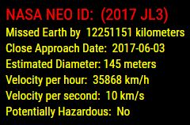

## MMM-NEO
Near Earth Objects.

Have you ever wondered how many Near Earth Objects are passing our planet every day?
How big are they? How fast are they travelling? Are they potentially dangerous? Be afraid. Be VERY afraid!

## Examples

* Annotated .css file included for aligning and coloring text and header.
* Works well when coupled with MMM-NASA which has stunning imagery.

, ,

* By itself. No header. Colored object name and colored information.

## Installation

* `git clone https://github.com/mykle1/MMM-NEO` into the `~/MagicMirror/modules` directory.

* No API needed!

## Config.js entry and options

    {
        module: 'MMM-NEO',
        position: 'top_left',               // Best in left, right or center regions
        config: { 
		rotateInterval: 5 * 60 * 1000,  // New Object Rotation
		useHeader: false,               // true if you want a header
		header: "",
		maxWidth: "275px",
		animationSpeed: 3000,           // Image fades in and out
        }
    },
	

## Special thanks to NASA's NEO team and SpaceCowboysDude
